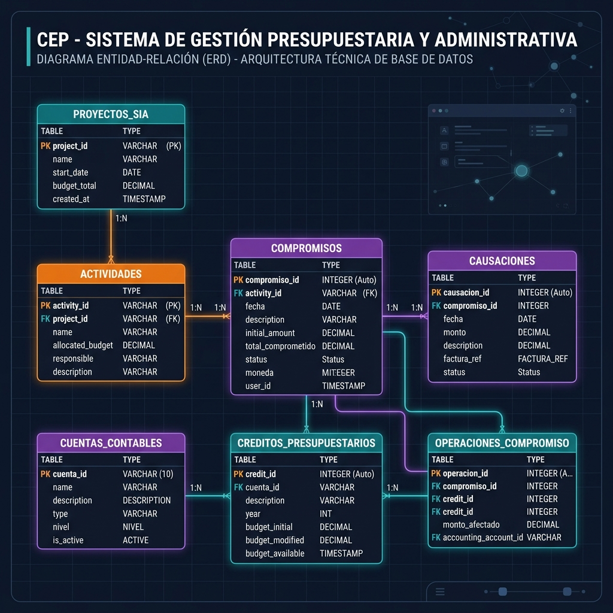

# Estructura de la Base de Datos - CEP

Este documento detalla la estructura y relaciones de la base de datos del sistema **CEP (Control de Ejecución Presupuestaria)**. La base de datos está organizada de forma modular para gestionar el presupuesto, la contabilidad, la tesorería, la nómina, el inventario y los bienes nacionales de la institución.

---

## Diagrama Entidad-Relación (DER)

A continuación se muestra una representación visual y moderna de la estructura de tablas y sus relaciones:

---

## Módulos del Sistema

La base de datos se divide en los siguientes módulos principales:

### 1. Módulo Presupuestario
Gestiona la formulación presupuestaria, créditos autorizados y sus modificaciones.
*   **`partidas_presupuestarias`**: Catálogo de clasificadores presupuestarios de gastos e ingresos (códigos de partidas, genéricas, específicas y subespecíficas).
*   **`creditos_presupuestarios`**: Montos asignados y aprobados para cada partida presupuestaria, unidad ejecutora y fuente de financiamiento en un ejercicio fiscal específico.
*   **`modificaciones_presupuestarias`**: Registro de traspasos, créditos adicionales y reducciones presupuestarias.
*   **`movimientos_partidas`**: Historial detallado de todas las transacciones que afectan los saldos de las partidas (compromisos, causaciones, pagos, etc.).

### 2. Módulo de Compras y Gasto (Ejecución Presupuestaria)
Controla las fases de ejecución del gasto desde la requisición/compromiso hasta la orden de pago.
*   **`compromisos`**: Registro de obligaciones financieras con beneficiarios/proveedores (reserva presupuestaria).
*   **`causaciones`**: Reconocimiento de la obligación de pago al recibirse bienes o servicios conformes (afectación del presupuesto de egresos).
*   **`ordenes_compra`** y **`ordenes_compra_detalle`**: Gestión de solicitudes de adquisición y sus respectivos artículos/servicios cotizados.
*   **`ordenes_pago`** y **`ordenes_pago_detalle`**: Órdenes de desembolso emitidas a Tesorería tras la causación.

### 3. Módulo de Tesorería y Bancos
Administra las cuentas bancarias de la institución, la recaudación de ingresos y los pagos emitidos.
*   **`cuentas_bancarias`**: Catálogo de cuentas corrientes/ahorros asociadas a la institución.
*   **`movimientos_bancarios`**: Historial de depósitos, retiros, transferencias, notas de débito y crédito.
*   **`pagos`**: Registro definitivo de cheques o transferencias procesadas a favor de los beneficiarios.
*   **`cajas`** y **`arqueos_caja`**: Control de flujo de caja menor y la conciliación/arqueo diario.
*   **`ingresos`** y **`conceptos_ingreso`**: Registro de ingresos institucionales y tasas recaudadas en caja.
*   **`conciliaciones_bancarias`** y **`conciliacion_detalles`**: Proceso mensual de conciliación entre extractos de banco y registros contables/libros.

### 4. Módulo Contable
Administra la contabilidad patrimonial y de orden integrada a la ejecución presupuestaria.
*   **`cuentas_contables`**: Plan de cuentas estructurado jerárquicamente (Activo, Pasivo, Patrimonio, Gastos, Ingresos, Cuentas de Orden).
*   **`asientos_contables`** y **`asientos_detalle`**: Comprobantes de diario (manuales o integrados automáticamente) con débitos y créditos equilibrados.
*   **`ejercicios_fiscales`**: Control del año presupuestario y contable activo/cerrado.
*   **`periodos_contables`**: Subdivisiones mensuales del ejercicio fiscal para cierres parciales.

### 5. Módulo de Nómina y Personal
Gestiona la ficha de los trabajadores de la institución y el cálculo periódico de su remuneración.
*   **`empleados`**: Ficha técnica del empleado (datos de identidad, académicos, militares, de salud y residencia).
*   **`cargos`**: Definición de puestos de trabajo, nivel jerárquico y salario base.
*   **`conceptos_nomina`**: Reglas de asignación y deducción salarial (cálculos fijos, porcentajes, etc.).
*   **`empleado_bonificaciones`**: Relación de asignaciones personalizadas de nómina por trabajador.
*   **`nominas`** y **`nominas_detalle`**: Historial de nóminas procesadas y detalle del pago neto transferido a cada empleado.
*   **`empleado_familiares`**, **`empleado_formaciones`**, **`empleado_historial_cargos`**: Información de soporte para cargas familiares, desarrollo profesional y trayectoria en la institución.

### 6. Módulo de Bienes Nacionales e Inventario
Lleva el inventario de almacén de consumo corriente e inventario físico de activos fijos.
*   **`articulos`**: Catálogo de bienes de consumo (materiales de oficina, repuestos) o servicios contratados.
*   **`almacenes`**: Depósitos físicos habilitados para almacenamiento.
*   **`inventario_movimientos`**: Registro de entradas, salidas, traslados y ajustes de inventario de consumo.
*   **`bienes`** y **`categorias_bien`**: Control de bienes nacionales muebles e inmuebles, registrando vida útil, tasa de depreciación y ubicación.
*   **`movimientos_bien`**: Historial de asignaciones, traslados, reparaciones y desincorporación (baja) de activos fijos.

---

## Seguridad y Auditoría
*   **`users`**: Usuarios del sistema con credenciales de acceso.
*   **`roles`**, **`permissions`**, **`model_has_roles`**: Matriz de permisos y roles del sistema (basado en Spatie Permission).
*   **`audits`**: Pistas de auditoría interna (audit log) que registran qué usuario modificó qué tabla, el valor anterior, el nuevo valor, dirección IP y el navegador empleado.
